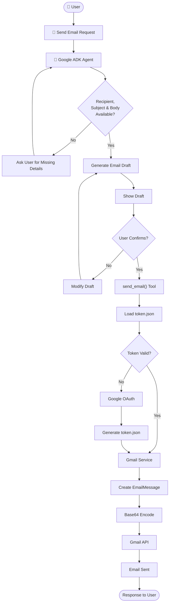

# 📧 Email ADK Agent
An AI-powered Email Assistant built using Google ADK.
## Workflow

```mermaid
flowchart TD

    A([👤 User])
    A --> B["💬 Send Email Request"]

    B --> C["🤖 Google ADK Agent"]

    C --> D{"Recipient,<br/>Subject & Body<br/>Available?"}

    D -- No --> E["Ask User for Missing Details"]
    E --> C

    D -- Yes --> F["Generate Email Draft"]

    F --> G["Show Draft"]

    G --> H{"User Confirms?"}

    H -- No --> I["Modify Draft"]
    I --> F

    H -- Yes --> J["send_email() Tool"]

    J --> K["Load token.json"]

    K --> L{"Token Valid?"}

    L -- Yes --> M["Gmail Service"]

    L -- No --> N["Google OAuth"]

    N --> O["Generate token.json"]

    O --> M

    M --> P["Create EmailMessage"]

    P --> Q["Base64 Encode"]

    Q --> R["Gmail API"]

    R --> S["Email Sent"]

    S --> T([Response to User])
```
